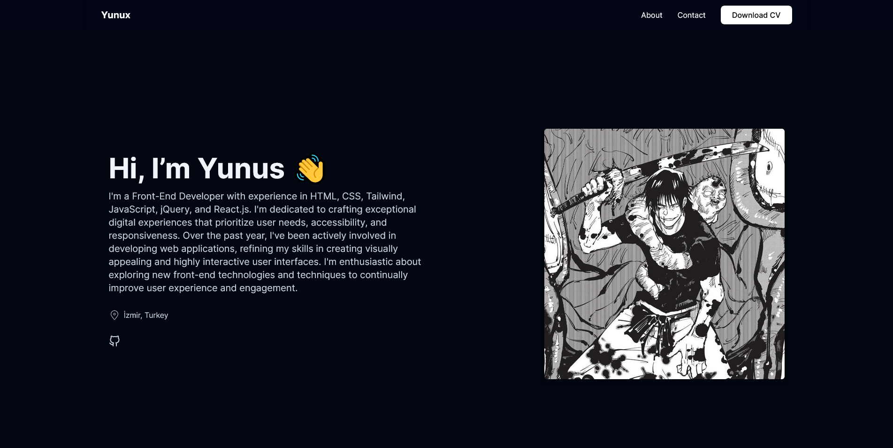

# Personal Website

Welcome to my personal website! This project is built using React, Tailwind CSS to create a modern, responsive, and visually appealing personal site.



## Demo

Check out the live demo [here](https://personal-website-page.vercel.app/).

## Installation

1. Clone the repository:
    ```bash
    git clone https://github.com/yourusername/personal-website.git
    ```
2. Navigate to the project directory:
    ```bash
    cd personal-website
    ```
3. Install the dependencies:
    ```bash
    npm install
    npm i react-icons
    npm i react-scroll
    ```
4. Start the development server:
    ```bash
    npm start
    ```

## Technologies Used

- **React**
- **Tailwind CSS**
- **React-icons**
- **React-scroll**
